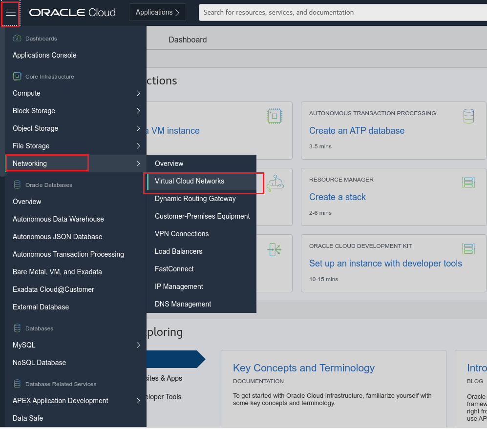
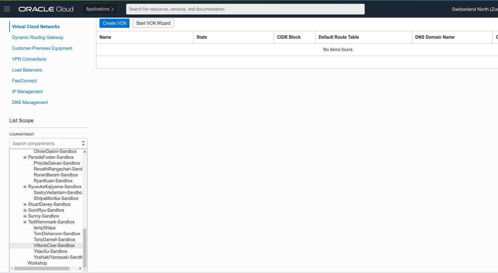
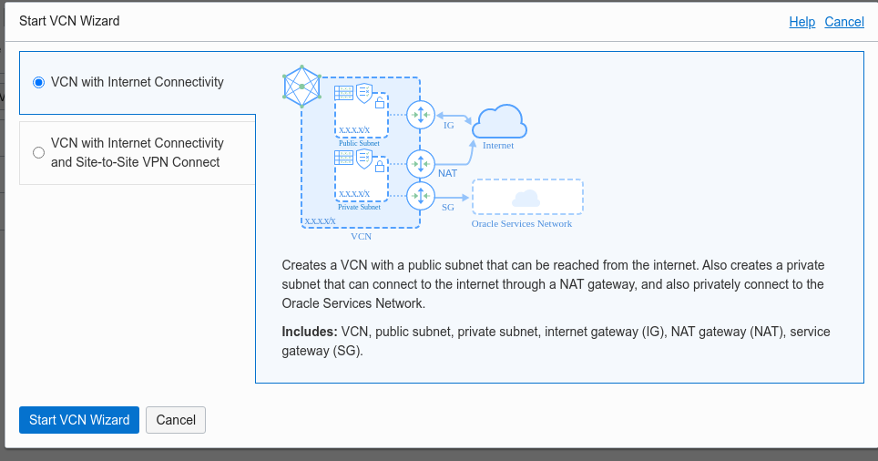
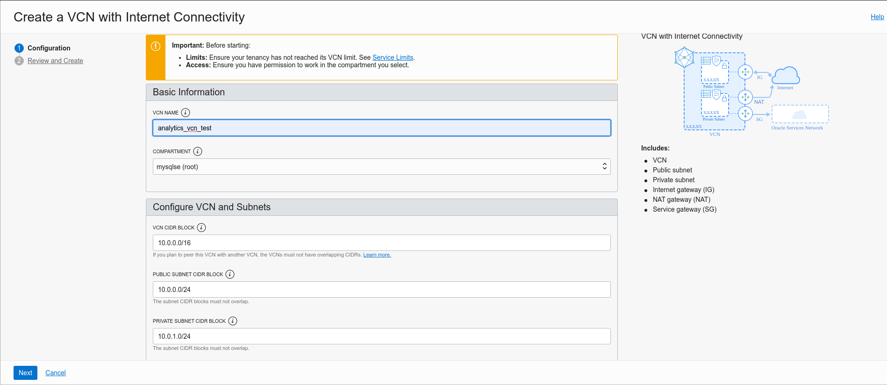
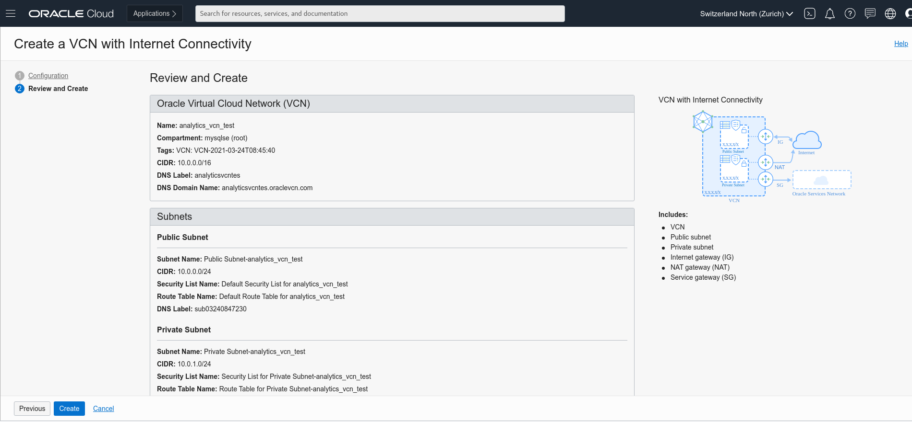
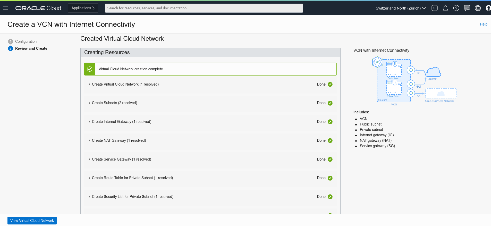
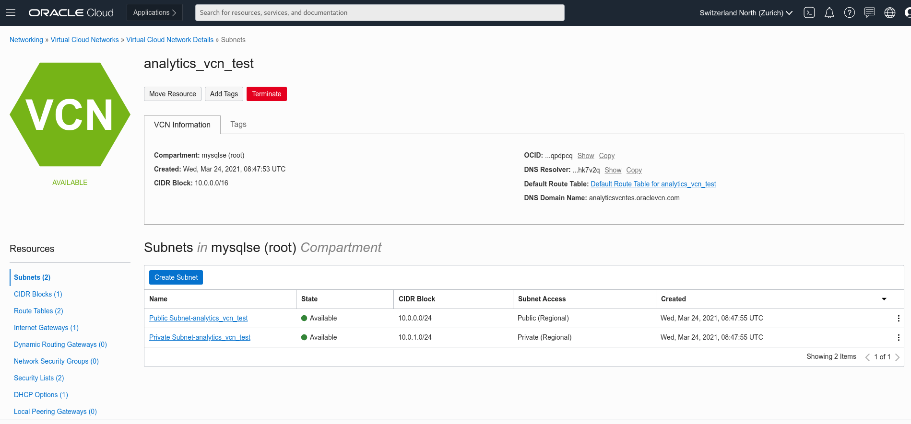
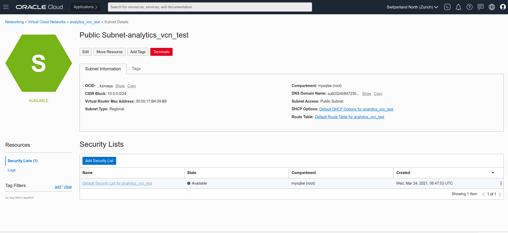
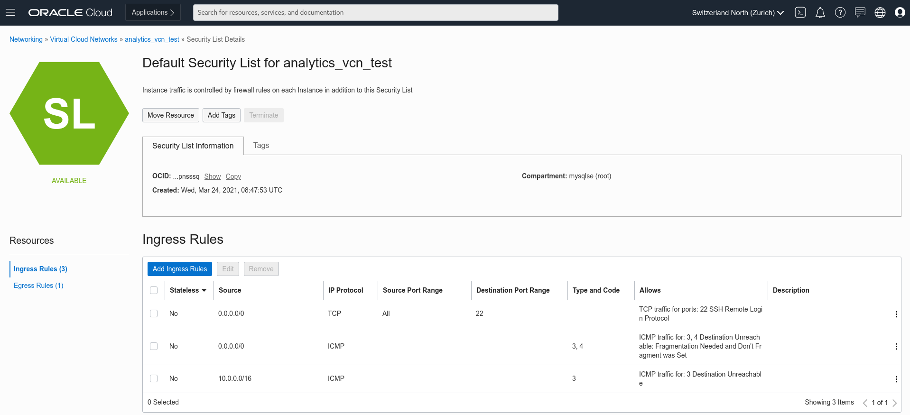
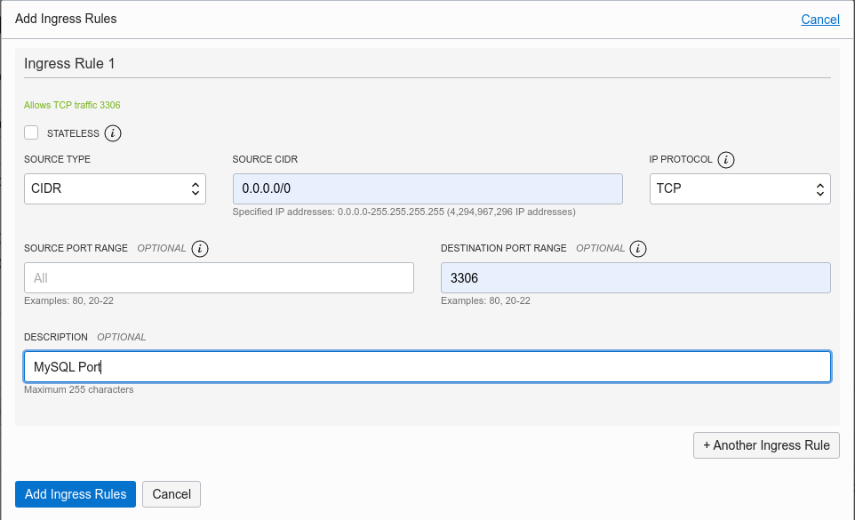

# Lab 1: Create VCN and allow MySQL ports

## Key Objectives:

- Learn how to create a Virtual Cloud Network with internet connectivity 
- Add ingress rules in the security list to allow MySQL ports

## Introduction

Virtual Cloud Network helps you define your own data centre network topology inside the Oracle Cloud, by defining some of the following components (Subnets, Route Tables, Security Lists, Gateways, etc.), some of these components are set by default automatically within every VCN that can't be deleted:
 - Default route table, with no route rules
 - Default security list, with default security rules
 - Default set of DHCP options, with default values
  
For an overview of VCNs, allowed size, default VCN components, and scenarios for using a VCN, check **[Networking Overview](https://docs.oracle.com/en-us/iaas/Content/Network/Concepts/overview.htm#network_landing)**.
A security list acts as a virtual firewall for an instance, with ingress and egress rules that specify the types of traffic allowed in and out. Each subnet can have multiple security lists associated with it, and each list can have multiple rules. 
The default security list comes with an initial set of stateful rules, which should in most cases be changed to only allow inbound traffic from authorized subnets relevant to the region that homes that VCN or subnet. A list of authorized subnet ranges relevant to each region can be found **[here](https://docs.cloud.oracle.com/iaas/tools/public_ip_ranges.json)**.

## Steps

### **Step 1.1:**
 - Log-in to your OCI tenancy. Once you have logged-in, select _**Networking >> Virtual Cloud Networks**_ from the _**menu icon**_ on the top left corner

### **Step 1.2:**
- From the Compartment picker on the bottom left side, select your compartment from the list

### **Step 1.3:** 
- To create a virtual cloud network, click on _**Start VCN Wizard**_ , 
  

### **Step 1.4:** 
- Select _**VCN with Internet Connectivity**_ and click _**Start VCN Wizard**_

### **Step 1.5:**
- Now you need to complete some infromation and set the configuration for the VCN. In the _**VCN NAME**_ field enter the value _**analytics_vcn_test**_ (or any name at your convenience), and make sure that the selected compartment is the right one. Leave all the rest as per default. Click next.

### **Step 1.6:** 
- Review and click _**Create**_

### **Step 1.7:** 
- Once the VCN will be created click _**View Virtual Cloud Network**_

### **Step 1.8:** 
- Click on the _**Public_Subnet-analytics_vcn_test**_ link. 

### **Step 1.9:** 
- Earlier you set up the subnet to use the VCN's default security list, that has default rules, which are designed to make it easy to get started with Oracle Cloud Infrastructure. Now to add additional rules to the default security list to allow access for MySQL ports, click on _**Default_Security_List_for_analytics_vcn_test**_

### **Step 1.10:** 
- Click on _**Add Ingress Rules**_

### **Step 1.11:**
- Here's how to add another rule to the default security list to enable that traffic:

Click _**+ Another Ingress Rule**_ and repeat for port 3306
At the end click the blue button _**Add Ingress Rules**_

## Conclusion

Now that we have learnt how to create the VCN and added an additional Ingress rules to the security list of the public subnet to  allow MySQL ports, you can proceed to the next lab! 

Learn more about **[VCN and Subnets](https://docs.oracle.com/en-us/iaas/Content/Network/Tasks/managingVCNs_topic-Overview_of_VCNs_and_Subnets.htm)**

**[Home](Readme.md)** | **[Go to Lab 2 >>](Lab2.md)**