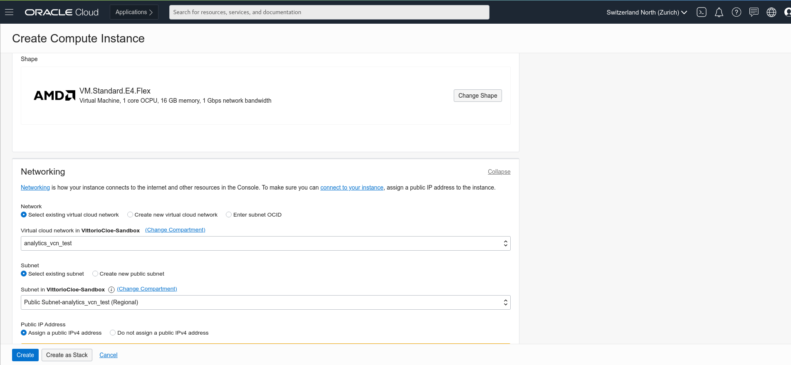

# Lab 2 - Create compute instance bastion host

_**2.1 -**_ From the main menu on the left select Compute >> Instances

_**2.2 -**_ Look at the compartment selector on the left and check that you are using the same compartment used to create the VCN and click on the _**Create Instance**_ blue button

_**2.3 -**_ In the _**Name_** filed, insert _**mysql-analytics-test-bridge**_ (or any other name at your convenience). This name will be used also as internal FQDN. 
The _**Placement and Hardware section**_ is the section where you can change Availability Domain, Fault Domain, Image to be used, and Shape of resources. For the scope of this workshop leave everything as is.

_**2.4 -**_ In the Networking section, check that your previously created VCN is selected and in the Subnet section, select your PUBLIC subnet (_**Public Subnet - analytics_vcn_test**_) from the dropdown menu.

_**2.5 -**_ Scroll down and MAKE SURE TO DOWNLOAD the proposed private key. 
You will use it to connect to the compute instance later on.
Once done, click _**Create**_

_**2.6 -**_ Once the compute instance will be up and running, you will see the square icon on the left turning green. It is anyway not necessary to wait.

**[Go to the next Lab](Lab3.md)**
