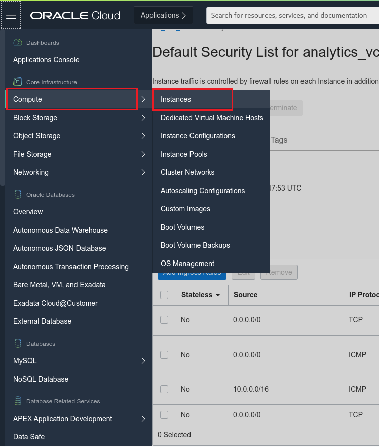
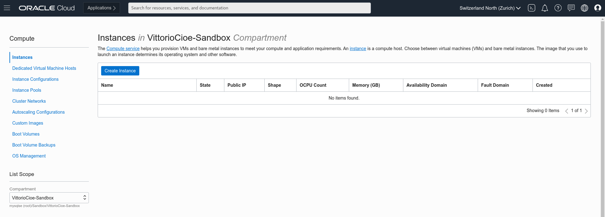
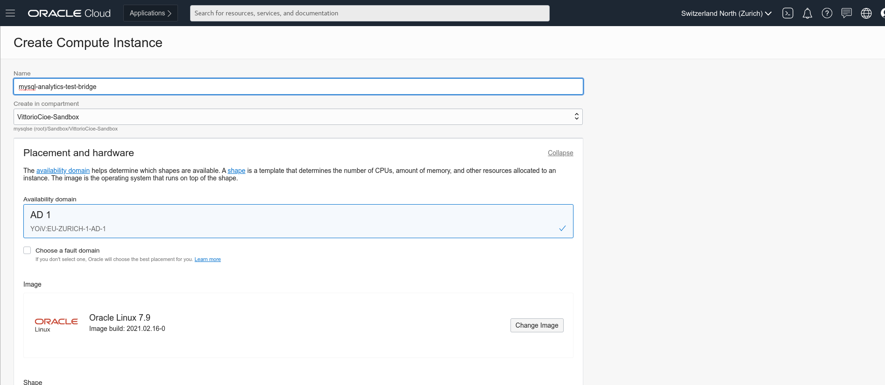
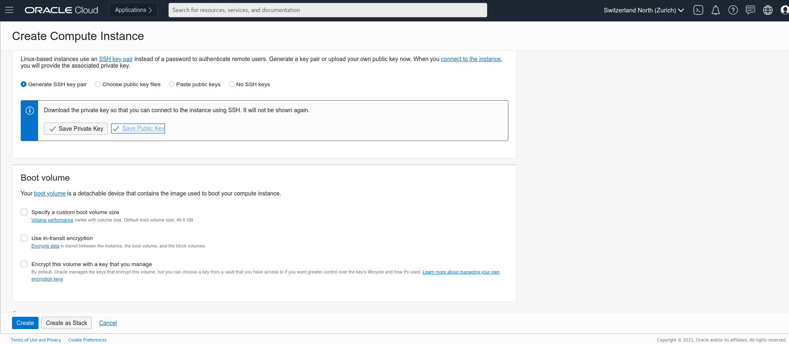
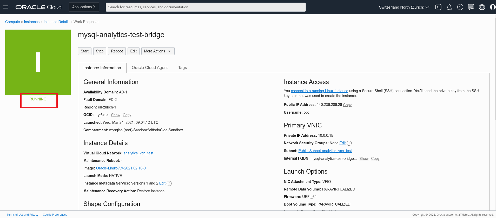

# Lab 2: Create a compute instance as a bastion host

## Key Objectives:

- Learn how to create a compute instance in a specific compartment 

## Introduction

A bastion host is a compute instance that serves as the public entry point for accessing a private network from external networks like the internet. Traffic must flow through the bastion host to access the private network, and you can set up security mechanisms on the bastion to handle that traffic.

See the white paper Bastion Hosts: **[Protected Access for Virtual Cloud Networks](https://www.oracle.com/a/ocom/docs/bastion-hosts.pdf)**. 

## Steps

### **Step 2.1:**
- From the main menu on the top left corner select _**Compute >> Instances**_
  

### **Step 2.2:** 
- In the compartment selector on the bottom left corner, select the same compartment where you created the VCN. Click on the _**Create Instance**_ blue button to create the compute instance.

### **Step 2.3:** 
- In the _**Name**_ field, insert _**mysql-analytics-test-bridge**_ (or any other name at your convenience). This name will be used also as internal FQDN. 
The _**Placement and Hardware section**_ is the section where you can change Availability Domain, Fault Domain, Image to be used, and Shape of resources. For the scope of this workshop leave everything as default.

- In the Networking section, check that your previously created VCN is selected, and select your PUBLIC subnet (_**Public Subnet - analytics_vcn_test**_) from the dropdown menu.
  

### **Step 2.4:** 
- Scroll down and MAKE SURE TO DOWNLOAD the proposed private key. 
You will use it to connect to the compute instance later on.
Once done, click _**Create**_

### **Step 2.5:** 
- Once the compute instance will be up and running, you will see the square icon on the left turning green.
 However, you can proceed to the next lab until the provisioning is done.
  

## Conclusion

In this lab we created a compute instance that serves as a bastion host that is a public entry point to the VCN created in the previous lab. You have then saved the private key on your local device to be able to connect to the Compute Instance. Now let's go ahead and deploy MySQL Database Service (MDS) with Heatwave in the next lab!
 
Learn more about **[Compute Service on Oracle Cloud](https://docs.oracle.com/en-us/iaas/Content/Compute/Concepts/computeoverview.htm)** 

 **[<< Go to Lab 1](Lab1.md)** | **[Home](Readme.md)** | **[Go to Lab 3 >>](Lab3.md)**