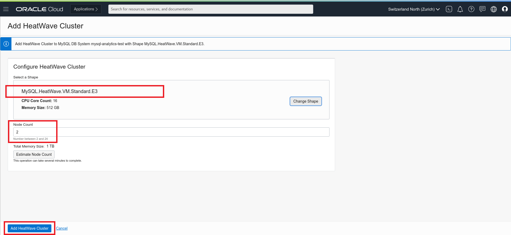

# Lab 5: HeatWaveクラスターをMySQL Database Serviceに追加する

## 実施すること
- HeatWaveクラスターを有効にする方法を学ぶ

## 概要

HeatWaveを選択すると、分析クエリの処理を高速化するためのHeatWaveクラスターのプロビジョニングが可能になります。 HeatWaveクラスターは、MySQL DBシステムノードと2つ以上のHeatWaveノードで構成されます。 MySQL DBシステムノードには、クラスター管理、クエリスケジューリング、およびクエリ結果のMySQL DBシステムへの応答を担当するHeatWaveプラグインが含まれています。 HeatWaveノードはデータをメモリに保存し、クエリを処理します。

HeatWaveクラスターを有効にすると、特定の条件を満たすクエリがMySQL DBシステムからHeatWaveクラスターに自動的にオフロードされ、クエリ処理が高速化されます。クエリは、MySQL　DBシステムノードに接続することでHeatWaveクラスターと対話するMySQLクライアントまたはアプリケーションから発行されます。結果は、MySQL DBシステムノードと、クエリを発行したMySQLクライアントまたはアプリケーションに返却されます。
HeatWaveクラスターをデプロイした後、データをロードしてクエリを実行する方法については、_**[HeatWaveユーザーガイド]（https://dev.mysql.com/doc/heatwave/en/）**_ を参照してください。

## 手順

### **Step 5.1:**
- 画面左上のメニューからIn the menu on the left, go to _**Databases >> DB Systems**_
Click on the DB System which you have previously created and verify that status is _**Active**_.
Take note of the _**Private IP Address**_ of the MySQL DB System.

### **Step 5.2:**
- Scroll down and select _**HeatWave**_ from the menu on the left.
  

### **Step 5.3:**
- Click on the button _**Add HeatWave Cluster**_ located on the right.
  

### **Step 5.4:**
- Check that Shape looks as per picture below and that Node Count is set to 2.
Click the blue button _**Add HeatWave Cluster**_

### **Step 5.5:**
- You will be brought back to the main page where you can check for the creation status. After some seconds you should see the nodes in _**Creating**_ status.
  

### **Step 5.6:**
- After completion, the node status will switch to _**Active**_ status. The process will take some time to be completed. 
  

## Conclusion

Now we have created HeatWave cluster, that consists of a MySQL DB System node and two or more HeatWave nodes.The MySQL DB System node includes a HeatWave plugin that is responsible for cluster management, query scheduling, and returning query results to the MySQL DB System. HeatWave nodes store data in memory and process queries. 
Learn more about **[HeatWave service on Oracle Cloud](https://docs.oracle.com/en-us/iaas/mysql-database/doc/heatwave1.html)** 
So let's connect to MySQL DB System and run some queries before we enable the HeatWave cluster in the next lab! 

**[<< Go to Lab 4](/Lab4/README.md)** | **[Home](../Readme.md)** | **[Go to Lab 6 >>](/Lab6/README.md)**
