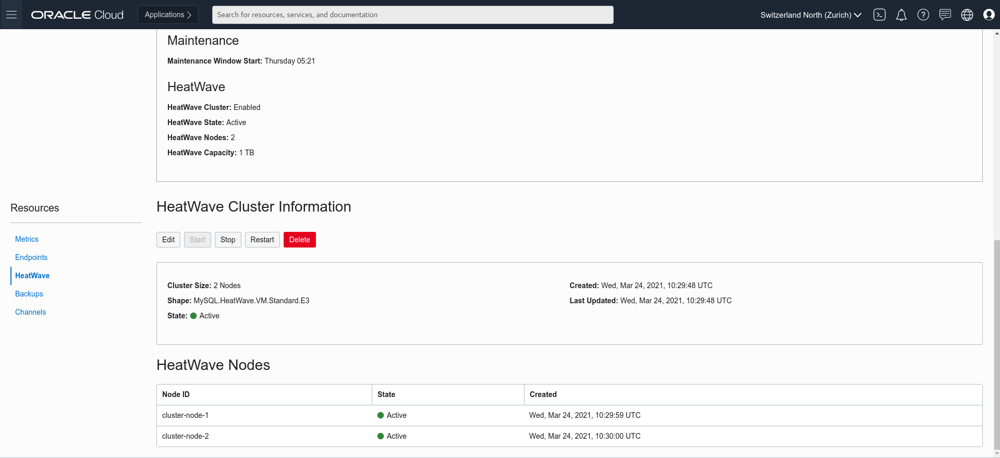

# Lab 7: Execute queries leveraging HeatWave

## Key Objectives:
- Learn how to enable Heatwave and compare the query execution time with and without HeatWave enabled.

## Introduction

HeatWave Cluster Node Count Estimates provide recommendations on how many HeatWave nodes are needed to run a workload. When the service is started, database tables dedicated to OLAP workloads need to be loaded to HeatWave cluster memory. The size of the HeatWave cluster depends on loaded tables and columns, and on the compression achieved in memory for this data. Under-provisioning the HeatWave cluster results in data load or query execution failure due to space limitations.


## Steps

### **Step 7.1:**
- On the OCI console, check that HeatWave nodes are in _**Active**_ status.
  



### **Step 7.2:**
- If HeatWave nodes are in _**Active**_ status, you can load the tpch database tables into HeatWave, from your bastion host ssh connection, using the following command:
```
mysqlsh --user=admin --password=Oracle.123 --host=<mysql_private_ip_address> --port=3306 --sql < tpch_offload.sql
```


 Now your good to go to _**Step 7.3**_.

- **YOU DON'T NEED TO RUN THE BELOW commands** unless you want to load additional tables into the tpch_offload.sql file 

The tpch_offload.sql scripts, apart from applying dictionary encoding to a some columns using _**'RAPID_COLUMN=ENCODING=SORTED'**_ (optional step), loads the tables into HeatWave setting the following values:
```
alter table <table_name> secondary_engine=rapid;
alter table  <table_name> secondary_load;
```
Additionally you can inspect the full content of the file, executing, from the Linux shell:
```
cat tpch_offload.sql
```


### **Step 7.3:**
- Let's come back to the previous query and execute it this time using HeatWave.

Connect to MySQL DB System:
```
mysqlsh --user=admin --password=Oracle.123 --host=<mysql_private_ip_address> --port=3306 --database=tpch --sql
```
- Now let's enable _**HeatWave**_  and let the Magic begin:
```
set @@use_secondary_engine=ON;
```

- Check the explain plan of the previous query and confirm it will be using secondary engine:
```
EXPLAIN SELECT
    l_returnflag,
    l_linestatus,
    SUM(l_quantity) AS sum_qty,
    SUM(l_extendedprice) AS sum_base_price,
    SUM(l_extendedprice * (1 - l_discount)) AS sum_disc_price,
    SUM(l_extendedprice * (1 - l_discount) * (1 + l_tax)) AS sum_charge,
    AVG(l_quantity) AS avg_qty,
    AVG(l_extendedprice) AS avg_price,
    AVG(l_discount) AS avg_disc,
    COUNT(*) AS count_order
FROM
    lineitem
WHERE
    l_shipdate <= DATE '1998-12-01' - INTERVAL '90' DAY
GROUP BY l_returnflag , l_linestatus
ORDER BY l_returnflag , l_linestatus;
```
(Look for the message "Using secondary engine RAPID" in the output)

```
+----+-------------+----------+------------+------+---------------+------+---------+------+---------+----------+----------------------------------------------------------------------------+
| id | select_type | table    | partitions | type | possible_keys | key  | key_len | ref  | rows    | filtered | Extra                                                                      |
+----+-------------+----------+------------+------+---------------+------+---------+------+---------+----------+----------------------------------------------------------------------------+
|  1 | SIMPLE      | lineitem | NULL       | ALL  | NULL          | NULL | NULL    | NULL | 5970493 |    33.33 | Using where; Using temporary; Using filesort; Using secondary engine RAPID |
+----+-------------+----------+------------+------+---------------+------+---------+------+---------+----------+----------------------------------------------------------------------------+
1 row in set, 1 warning (0.0123 sec)
```

- Re-run the previous query and check the execution time again:
```
SELECT
    l_returnflag,
    l_linestatus,
    SUM(l_quantity) AS sum_qty,
    SUM(l_extendedprice) AS sum_base_price,
    SUM(l_extendedprice * (1 - l_discount)) AS sum_disc_price,
    SUM(l_extendedprice * (1 - l_discount) * (1 + l_tax)) AS sum_charge,
    AVG(l_quantity) AS avg_qty,
    AVG(l_extendedprice) AS avg_price,
    AVG(l_discount) AS avg_disc,
    COUNT(*) AS count_order
FROM
    lineitem
WHERE
    l_shipdate <= DATE '1998-12-01' - INTERVAL '90' DAY
GROUP BY l_returnflag , l_linestatus
ORDER BY l_returnflag , l_linestatus;
```

- This time execution time should be about 0.2-0.05s!!

```
+--------------+--------------+-------------+-----------------+-------------------+---------------------+-----------+--------------+----------+-------------+
| l_returnflag | l_linestatus | sum_qty     | sum_base_price  | sum_disc_price    | sum_charge          | avg_qty   | avg_price    | avg_disc | count_order |
+--------------+--------------+-------------+-----------------+-------------------+---------------------+-----------+--------------+----------+-------------+
| A            | F            | 37734107.00 |  56586554400.73 |  53758257134.8700 |  55909065222.827692 | 25.522005 | 38273.129734 | 0.049985 |     1478493 |
| N            | F            |   991417.00 |   1487504710.38 |   1413082168.0541 |   1469649223.194375 | 25.516471 | 38284.467760 | 0.050093 |       38854 |
| N            | O            | 74476040.00 | 111701729697.74 | 106118230307.6056 | 110367043872.497010 | 25.502226 | 38249.117988 | 0.049996 |     2920374 |
| R            | F            | 37719753.00 |  56568041380.90 |  53741292684.6040 |  55889619119.831932 | 25.505793 | 38250.854626 | 0.050009 |     1478870 |
+--------------+--------------+-------------+-----------------+-------------------+---------------------+-----------+--------------+----------+-------------+
4 rows in set (0.0820 sec)
```
### **Step 7.4:**

For proper execution of the **Bonus Lab 8** we suggest you to run the following query at this stage,

```
CREATE VIEW myAnalyticsView AS SELECT * 
    FROM customer JOIN orders ON customer.C_CUSTKEY=orders.O_CUSTKEY
    JOIN nation ON customer.C_NATIONKEY=nation.N_NATIONKEY;
    
```
- Exit from MySQL Shell:
```
\q

```

### **Step 7.5:**
- Now that you have understood how HeatWave offloading works and which performance gain it can give, it is time to run some batch execution.

We will run the script tpch_queries_mysql.sql to execute some queries without using HeatWave.
Then, we will run the script tpch_queries_rapid.sql to execute the same queries using HeatWave.
In the end, we will compare the results.
**Please note** that the query that doesn't use the HeatWave might take some minutes to be completed.

For this excercise, instead of MySQL Shell, we will use MySQL client:
Run the following commands:
```
mysql -h<mysql ip addr> -uadmin -pOracle.123 -Dtpch < tpch_queries_rapid.sql
```
```
mysql -h<mysql ip addr> -uadmin -pOracle.123 -Dtpch < tpch_queries_mysql.sql
```
```
diff -y rapid_rt_profiles.log mysql_rt_profiles.log
```

- The output of the last command should look as follows:

```
Query_ID	Duration	Query				Query_ID	Duration	Query
1	0.43741500	SELECT \n    l_returnflag,\n    l_lin |	1	13.34447075	SELECT \n    l_returnflag,\n    l_lin
2	0.05510250	SELECT \n    l_orderkey,\n    SUM(l_e |	2	2.81767825	SELECT \n    l_orderkey,\n    SUM(l_e
3	0.03569350	SELECT \n    O_ORDERPRIORITY, COUNT(* |	3	0.67656550	SELECT \n    O_ORDERPRIORITY, COUNT(*
4	0.29090700	SELECT \n    n_name, SUM(l_extendedpr |	4	3.43357100	SELECT \n    n_name, SUM(l_extendedpr
5	0.01475100	SELECT \n    SUM(l_extendedprice * l_ |	5	1.92334425	SELECT \n    SUM(l_extendedprice * l_
6	0.12739250	SELECT \n    supp_nation, cust_nation |	6	2.91310275	SELECT \n    supp_nation, cust_nation
7	0.05971975	SELECT \n    o_year,\n    SUM(CASE\n  |	7	2.32921225	SELECT \n    o_year,\n    SUM(CASE\n 
8	0.09896975	SELECT \n    nation, o_year, SUM(amou |	8	6.26314100	SELECT \n    nation, o_year, SUM(amou
9	0.04798775	SELECT \n    c_custkey,\n    c_name,\ |	9	1.26776875	SELECT \n    c_custkey,\n    c_name,\
10	0.10815325	SELECT \n    PS_PARTKEY, SUM(PS_SUPPL |	10	0.43670475	SELECT \n    PS_PARTKEY, SUM(PS_SUPPL
11	0.02604025	SELECT \n    l_shipmode,\n    SUM(CAS |	11	2.56930425	SELECT \n    l_shipmode,\n    SUM(CAS
12	0.05837475	SELECT \n    c_count, COUNT(*) AS cus |	12	2.04714750	SELECT \n    c_count, COUNT(*) AS cus
13	0.02064350	SELECT \n    100.00 * SUM(CASE\n      |	13	1.95272375	SELECT \n    100.00 * SUM(CASE\n     
14	0.02863725	WITH REVENUE0 AS (\nSELECT \n    L_SU |	14	2.08620250	WITH REVENUE0 AS (\nSELECT \n    L_SU
15	0.12952825	SELECT \n    P_BRAND,\n    P_TYPE,\n  |	15	0.31044925	SELECT \n    P_BRAND,\n    P_TYPE,\n 
16	0.15458875	SELECT \n    C_NAME,\n    C_CUSTKEY,\ |	16	2.54871800	SELECT \n    C_NAME,\n    C_CUSTKEY,\
17	0.02226300	SELECT \n    SUM(l_extendedprice * (1 |	17	773.58222775	SELECT \n    SUM(l_extendedprice * (1
18	0.05721275	SELECT \n    CNTRYCODE, COUNT(*) AS N |	18	0.75508325	SELECT \n    CNTRYCODE, COUNT(*) AS N
```

- Now, you can compare the execution times obtained using HeatWave or only MySQL on InnoDB.

Optional: inspect the tpch_queries_mysql.sql and the tpch_queries_rapid.sql scripts using vi.


## Conclusion

Observing the results, we got the query result back in less than a second when a HeatWave cluster is enabled, queries that meet certain prerequisites are automatically offloaded from the MySQL DB System to the HeatWave cluster for accelerated execution. Queries are issued from a MySQL client or application that interacts with the HeatWave cluster by connecting to the MySQL DB System node. Results are returned to the MySQL DB System node and to the MySQL client or application that issued the query. 

## Great Work - All Done!

**[<< Go to Lab 6](Lab6.md)** | **[Home](Readme.md)** | **[Go to Bonus Lab 8 >>](Lab8_Bonus_OAC.md)**
