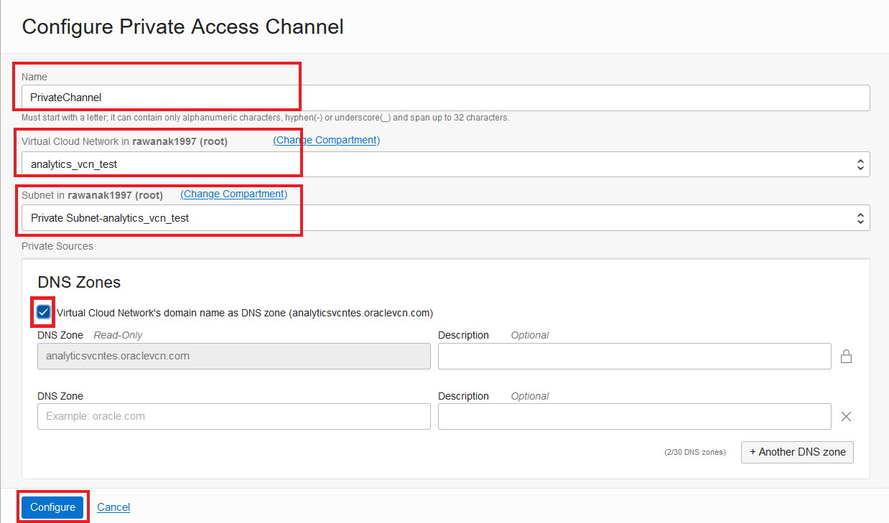

# Bonus Lab: Use Analytics Cloud on MySQL Database Service powered by Heatwave

## Key Objectives:
- Learn how to use Oracle Analytics Cloud on MySQL Database Service powered by HeatWawe.

## Introduction

Oracle Analytics Cloud gives you a complete, connected, collaborative platform that brings the power of data and analytics to every process, interaction, and decision in every environment – cloud, on-premises, desktop and data center. You can read more **[here!](https://www.oracle.com/middleware/technologies/oracle-analytics-cloud.html)**

## Prerequisite

- To be able to successfully test bonus lab please complete all the previous labs in this workshop.
  
_**To address your question you can send it on**_ **[Discord mysql-heatwave channel.](https://discord.gg/73Gx9Ws7tM)** 

## Steps

### **Step 8.1:**

- From the Cloud shell connect to MySQL DB System:
  
```
mysqlsh --user=admin --password=Oracle.123 --host=<mysql_private_ip_address> --port=3306 --database=tpch --sql
```

Run the following query at this stage,

```
CREATE VIEW myAnalyticsView AS SELECT * 
    FROM customer JOIN orders ON customer.C_CUSTKEY=orders.O_CUSTKEY
    JOIN nation ON customer.C_NATIONKEY=nation.N_NATIONKEY;
    
```


Click the _**hamburger menu**_ in the upper left corner and click on _**Analytics -> Analytics Cloud**_.


### **Step 8.2:**
Click _**Create instance**_ and in the new window, fill out the fields as shown in the image below. Make sure to select 2 OCPUs, the Enterprise version and the _**License Included**_ button. Finally click _**Create**_ to start the provisioning of the instance.
_**Note:**_ It takes about _**15-20 minutes**_ to create the OAC instance so go get a coffee in the meantime!


### **Step 8.3:**
When the status of the instance changes to _Active_, click on the button _**Configure Private Access Channel**_ to create a private access to the MySQL Database Service Instance.


### **Step 8.4:**
In the next window you first need to choose a name for the channel. Then, fill in the VCN name with the same one where you provisioned the MySQL Database Service and the Heatwawe cluster. Make sure you select the correct subnet! (In lab 1 you had the option to select Private Subnet or Public Subnet) make sure you select the correct one otherwise you won't be able to connect!
Check _**Virtal Cloud Network's domain name as DNS zone**_, and remove the additional _**DNS Zone**_, and finally click _**Configure**_.  

_**Note:**_ It will take about _**50 minutes**_ to create the private channel so go get a nice cup of tea to kill the time! 



### **Step 8.5:**
When the status of the instance changes to _Active_, click on the button _**Analytics Home Page Channel**_ to access Oracle Analytics Cloud!


### **Step 8.6:**
We now want to connect to our MySQL Database Service, so from the top right corner click _**Create**_ and then _**Connection**_ as shown in the picture below. From the list of connectors, select _**MySQL**_


### **Step 8.7:**

Browse the connection type or simply type in the search section _**MySQL**_, and Click it.


In the new window we have a lot of information we need to provide. The host name we need to provide is a little bit tricky, we need to provide the Internal FQDN (fully qualified domain name) of the MySQL Database Instance. To find this out, you need to go back to the MySQL instance details.

In the section Endpoint you'll find all the information required. See the following images if you need guidance. 


As database name, you need to use _**tpch**_, the database we used in the previous labs, and fill in with the credentials metioned when creating the MySQL DB System

```
username: admin
password: Oracle.123
```
After you filled out everything, click on _**Save**_.


You Oracle Analytics Instance is now connected to your MySQL Database Service powered by Heatwawe.

### **Step 8.8:**
Let's now use this connection to create a very simple dashboard! From the top right corner click _**Create**_ and this time click on _**Dataset**_ as shown in the picture below.


### **Step 8.9:**
From the new window select the connection we just created.


Click on the _**tpch**_ database as shown below.


### **Step 8.10:**
Now, you'll see all the database's tables and views. Select the view we created for this lab called _**myAnalyticsView**_. Then on the button, _**Add All**_ to add all the columns and then on the top right corner, _**Add**_


We are creating a Dataset based on all the columns of the view _**myAnalyticsView**_


### **Step 8.11:**
Now you can see the data that has been retrieved. From the _**Reccomendations**_ column on the right we could use the suggestions to clean the data. We'll leave this topic for another time but feel free to check Oracle's documentation on how to use this useful feature!

To move forward click on _**Create Project**_  button on the top right corner. You will see the Visualisation screen where you can start building your dashboards!


### **Step 8.12:** CREATE YOUR FIRST DASHBOARD

From the left, select the column _**N_NAME**_ and then, while pressing CTRL (or Comamnd if you are on Mac) click _**O_TOTALPRICE**_, right click and select _**Create Best Visualization**.


A nice histogram will appear after few seconds later and we'll see that every country contributes equally to the company's revenues.


## Conclusion

You now have all the tools to discover insights in your data!

If you want to discover more on how to use Oracle Analytics Cloud check our **[Tutorials](https://docs.oracle.com/en/cloud/paas/analytics-cloud/tutorials.html)** and **[Live Labs!](https://apexapps.oracle.com/pls/apex/dbpm/r/livelabs/livelabs-workshop-cards?p100_focus_area=28&me=117&clear=100&session=107258786260970)**

**[<< Go to Lab 7](/Lab7/README.md)** | **[Home](../README.md)** 
