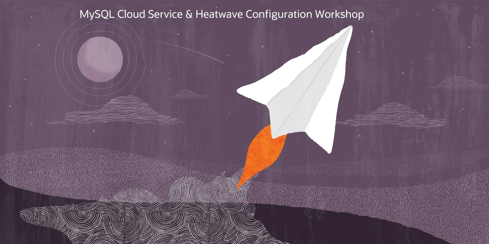

# MySQL Cloud Service & Heatwave Configuration Workshop 

This workshop will walk you through the process to configure MySQL Cloud Service & Heatwave to run Analytics workloads in Oracle Cloud
The dataset useed for this workshop includes many attributes that we will use to run some queries with and without Heatwave and compare the execution times obtained using HeatWave or only MySQL on InnoDB. 

**Key Objectives:**

- Learn how to deploy MySQL Database Service (MDS) DB System for HeatWave
- Learn how to add a HeatWave cluster to an MDS DB System
- Learn how to import data into MDS from an external data source
- Understand how tables are loaded to HeatWave
- Learn how to run queries using traditional MySQL and/or HeatWave

**Prerequisites:**
- This workshop requires an Oracle Public Cloud account. You may use your own cloud account, a cloud account that you obtained through a trial, or a training account whose details were given to you by an Oracle instructor.
- A Cloud tenancy where you have a compartment provisioned in.
  

# Workshop Overview
 
 ## Before You Begin
 **What is the Heatwave?**

 HeatWave is a new, integrated, high-performance analytics engine for MySQL Database Service. HeatWave accelerates MySQL performance by 400X for analytics queries, scales out to thousands of cores, and is 2.7X faster at one-third the cost of Amazon Redshift. MySQL Database Service, with HeatWave, is the only service that enables database admins and app developers to run OLTP and OLAP workloads directly from their MySQL database, eliminating the need for complex, time-consuming, and expensive data movement and integration with a separate analytics database. The service is optimized for and exclusively available in Oracle Cloud Infrastructure (OCI).

 **All set? Let's start**

## Lab 1: Create VCN and allow MySQL ports

**Key Objectives:**

- Learn how to create a Virtual Cloud Network 

**[Click here for Lab 1](./Lab1.md)**

## Lab 2 – Create compute instance bastion host

**Key Objectives:**

- Learn how to create a compute instance in the choosen compartment
  
**[Click here for Lab 2](./Lab2.md)**

## Lab 3 - Create MySQL DB System (MDS) for Heatwave

**Key Objectives:**

- Learn how to create a MySQL DB System with Heatwave 
- Learn how to create Administrator user for the DB
  
**[Click here for Lab 3](./Lab3.md)**

## Lab 4 – Connect to bastion host, install MySQL Shell and download workshop data

**Key Objectives:**

- Learn how to connect to the cloud shell and the bastion host
- Learn how to launch MySQL shell
- Setp the workshop material

**[Click here for Lab 4](./Lab4.md)**

## Lab 5 – Add Heatwave cluster to MySQL DB-System

**Key Objectives:**

- Learn how to create Heatwave cluster
  
**[Click here for Lab 5](./Lab5.md)**

## Lab 6 – Import data into MDS and load tables to HeatWave 

**Key Objectives:**

- Learn how to connect and import dataset into MySQL DB System
  
**[Click here for Lab 6](./Lab6.md)**

## Lab 7 – Execute queries using Heatwave

**Key Objectives:**

- Learn how to enable Heatwave and compare the service performance 
  
**[Click here for Lab 7](./Lab7.md)**

## Bonus Lab 8 – Use Analytics Cloud on MySQL Database Service powered by Heatwawe

**Key Objectives:**

- We wanted to give an additional experience post workshop to learn how to Use Analytics Cloud on MySQL Database Service powered by Heatwawe
  
**[Click here for Lab 8](./Lab8_Bonus_OAC.md)**

## Bonus Lab 9 – Use Data Integration to build your data pipeline with MySQL and HeatWave

**Key Objectives:**

- Want to consolidate data from other sources and build your own data pipeline? Even more, do you want to use MySQL and HeatWave for Data Science? This bonus track guide you step by step on how to do it.
  
**[Click here for Lab 9](./Lab9_Bonus_DI.md)**